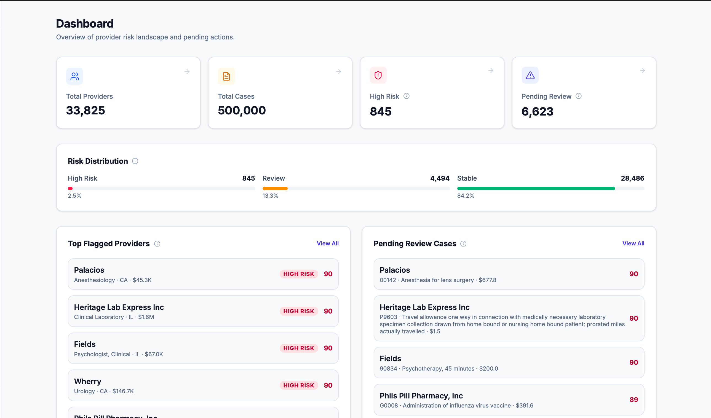
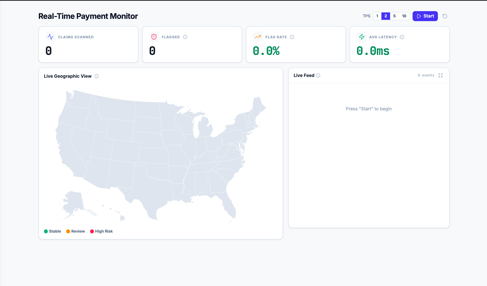
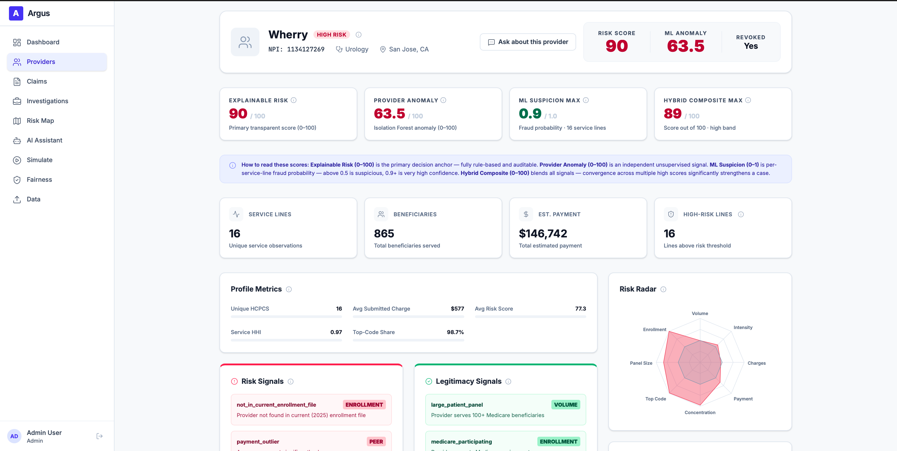
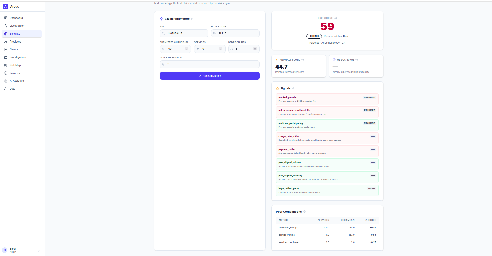
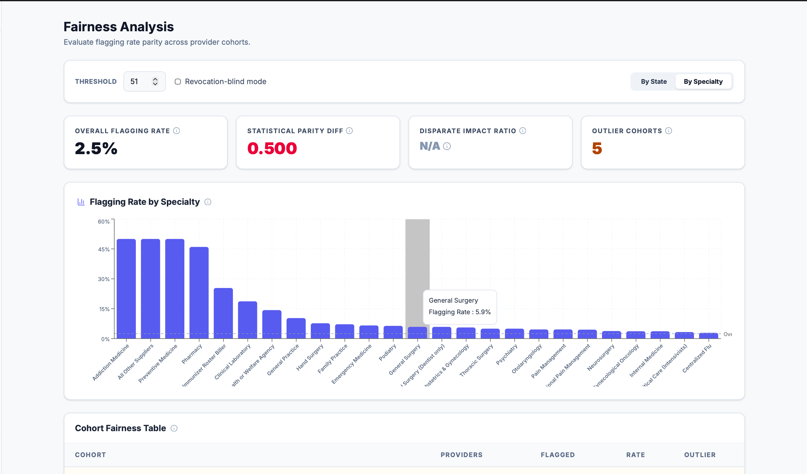
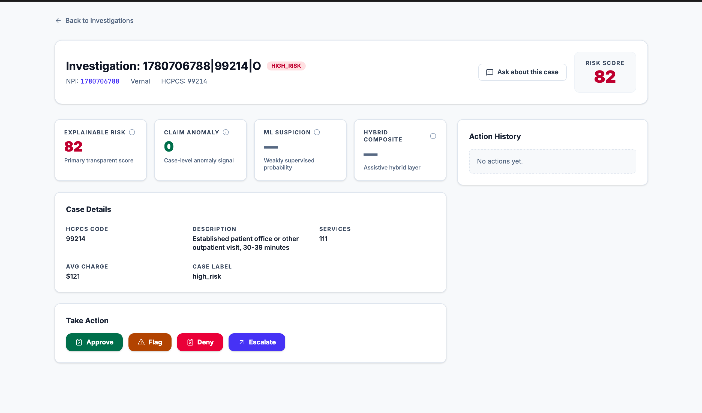
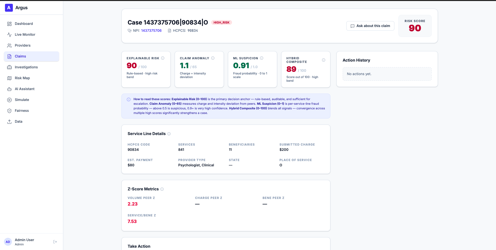
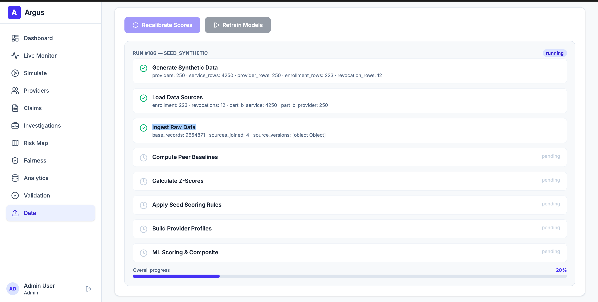

# Argus — CMS Proactive Program Integrity

> **91% of eventually-revoked providers detected from billing patterns alone** — before CMS acted on revocation.

CMS loses an estimated **$60 billion annually** to improper payments across Medicare and Medicaid. Current detection is largely reactive — fraud is identified after payments are made, forcing a costly "pay-and-chase" cycle. Argus is a decision-support system that identifies anomalous provider billing patterns, surfaces evidence-backed risk cases, and provides explainable scores that human reviewers can act on **proactively, in real time**.

| Resource | Link |
| -------- | ---- |
| Live App | [argus.precise-lab.com](https://argus.precise-lab.com) |
| GitHub | [precisesoft/cms-fraud-detection](https://github.com/precisesoft/cms-fraud-detection) |
| Architecture | [docs/architecture-v3.md](docs/architecture-v3.md) |
| Demo Script | [docs/demo-script.md](docs/demo-script.md) |
| Responsible AI | [docs/responsible-ai-considerations.md](docs/responsible-ai-considerations.md) |
| Path to Pilot | [docs/path-to-cms-pilot.md](docs/path-to-cms-pilot.md) |

**Judge access note**: the live website is protected by HTTP basic auth during evaluation. If you have login issues, contact `arun.sanna@precise-soft.com`.



---

## Judge Quick Links

| Deliverable | Link |
| ----------- | ---- |
| Demo Script | [docs/demo-script.md](docs/demo-script.md) |
| Architecture | [docs/architecture-v3.md](docs/architecture-v3.md) |
| Risk Scoring Methodology | [docs/risk-scoring-methodology.md](docs/risk-scoring-methodology.md) |
| Responsible AI Considerations | [docs/responsible-ai-considerations.md](docs/responsible-ai-considerations.md) |
| Isolation Forest Model Card | [docs/model-card-isolation-forest.md](docs/model-card-isolation-forest.md) |
| AI and Open Source Disclosure | [docs/ai-oss-disclosure.md](docs/ai-oss-disclosure.md) |
| Path to CMS Pilot | [docs/path-to-cms-pilot.md](docs/path-to-cms-pilot.md) |
| Architecture Diagrams | [docs/diagrams/](docs/diagrams/) |

---

## Judging Snapshot

| Criterion | Why Argus Scores Well | Evidence |
| --------- | --------------------- | -------- |
| **Mission Relevance** | Targets CMS improper payments with a proactive provider-risk workflow instead of post-payment recovery alone. | [Problem framing](docs/problem-statement.md), [Validated Results](#validated-results), [Investigation Workflow](#investigation-workflow--case-management) |
| **Technical Soundness** | End-to-end working system: ETL, scoring engine, fairness analysis, investigation UI, and live deployment. | [Architecture](docs/architecture-v3.md), [Live app](https://argus.precise-lab.com), [Demo script](docs/demo-script.md) |
| **Explainability & Responsible AI** | Deterministic scoring, named signals, evidence provenance, fairness monitoring, and human-in-the-loop review. | [Explainability and Responsible AI](#explainability-and-responsible-ai), [Risk scoring methodology](docs/risk-scoring-methodology.md), [Model card](docs/model-card-isolation-forest.md) |
| **Feasibility for Adoption** | Uses public CMS data today, avoids PHI, deploys on AWS, and has a documented path from MVP to government pilot. | [Feasibility for Government Adoption](#feasibility-for-government-adoption), [Path to CMS Pilot](docs/path-to-cms-pilot.md) |
| **Innovation** | Combines dual scoring, per-provider ML explainability, evidence graph views, and AI-assisted investigation. | [Why Argus Stands Out](#why-argus-stands-out), [Risk scoring methodology](docs/risk-scoring-methodology.md), [Architecture](docs/architecture-v3.md) |
| **Demo Clarity** | Includes a guided narrative, live screens, and judge-ready supporting documents. | [Judge Quick Links](#judge-quick-links), [Demo Script](docs/demo-script.md), [Judge Deliverables](#judge-deliverables) |

---

## How It Works

```
  19GB real CMS data          13 explainable signals           Evidence-backed cases
 (4 public datasets)    ──>  (risk + legitimacy scoring)  ──>  for human investigators
                              + ML anomaly detection            + AI-generated narratives
```

1. **Ingest** — 19GB of real, public Medicare data: 9.66M service lines across 10,282 providers from [data.cms.gov](https://data.cms.gov). No PHI. Core scoring and validation use real public CMS data; synthetic records are only used in separate admin/demo workflows.
2. **Score** — Every provider-service case receives two independent scores: a **risk score** (how anomalous vs. peers) and a **legitimacy score** (how many trust indicators exist). 13 named signals, each with a threshold, weight, and data-source citation. Plus an independent Isolation Forest anomaly score with per-provider feature importance.
3. **Investigate** — Analysts review flagged cases with full signal breakdowns, peer comparison charts, evidence graphs, and AI-generated narratives. The system explains; the human decides.

---

## Validated Results

We didn't just build a scoring system — we validated it. We took all 335 revoked providers in our dataset, **removed the revocation flag**, and re-scored them using only behavioral signals.

| Metric | Current Result |
| ------ | -------------- |
| Revoked providers detected, blind provider-level | **306 / 335 (91.34%)** |
| Revoked cases detected, blind case-level | **779 / 862 (90.37%)** |
| Non-revoked provider baseline flagging | **51.47%** |
| Detection lift over non-revoked baseline | **1.77x** |
| Felony-related revocations detected | **100%** |
| Billing-abuse revocations detected | **94.12%** |

**Methodology**: The retrospective validation endpoint (`/api/validation`) removes the `revoked_provider` signal and re-scores providers using only behavioral signals, including peer comparisons, enrollment context, charge patterns, and concentration metrics. In the current artifact, 306 of 335 revoked providers still land in the `review` or `high_risk` bands without using the revocation label.

**Source of truth**: [`data/validation/retrospective_results.json`](data/validation/retrospective_results.json) powers the API response and the judge-facing validation story.

**Try it live**: [argus.precise-lab.com/api/validation](https://argus.precise-lab.com/api/validation)  
The site is behind HTTP basic auth during judging. If access fails, contact `arun.sanna@precise-soft.com`.

---

## Why Argus Stands Out

### Dual Scoring — Risk and Legitimacy

Traditional fraud detection produces a single risk score. Argus computes **two independent scores** for every case. A provider with high volume (risk signal) who is enrolled, Medicare-participating, and peer-aligned on all other metrics (legitimacy signals) won't be flagged — the legitimacy score contextualizes the risk. This reduces false positives and ensures providers aren't flagged on a single anomalous metric.

### Per-Provider ML Explainability

The Isolation Forest anomaly model provides per-provider feature importance via leave-one-out approximation — not a global average, but which specific features drive _this_ provider's anomaly score. Risk-increasing features shown in red, protective features in green, all computed in under 100ms.

### Real-Time Scoring

Claims stream via Server-Sent Events, scored by the 13-signal engine in **under 50 milliseconds**. No batch jobs, no overnight processing — proactive detection as payments arrive.

### Built-In Fairness Monitoring

A dedicated `/api/fairness` endpoint computes flagging rate disparities across geography and specialty using statistical parity difference, disparate impact ratio (EEOC four-fifths rule), and outlier detection. Configurable threshold. No demographic variables are used in scoring.

### AI-Assisted Investigation

AWS Bedrock Claude powers three capabilities: **text-to-SQL** (analysts ask questions in plain English), **risk narratives** (structured signals summarized in plain language), and **chat** (conversational investigation). All AI output is advisory — the scoring engine is fully deterministic and AI-free.

---

## Explainability and Responsible AI

Argus is designed as a decision-support system, not an autonomous enforcement engine.

- **Human in the loop**: analysts review evidence packages, take explicit case actions, and retain final decision authority.
- **Explainable outputs**: every case exposes the signals, thresholds, peer baselines, evidence provenance, and narrative explanation behind its score.
- **Responsible ML use**: the deterministic scoring engine remains primary; the Isolation Forest model is supportive and documented through a formal model card.
- **Fairness monitoring**: the `/api/fairness` workflow measures flagging disparities across state and specialty using statistical parity difference, disparate impact ratio, and outlier analysis.

Supporting docs:
- [Responsible AI considerations](docs/responsible-ai-considerations.md)
- [Risk scoring methodology](docs/risk-scoring-methodology.md)
- [Isolation Forest model card](docs/model-card-isolation-forest.md)
- [AI and open-source disclosure](docs/ai-oss-disclosure.md)

---

## Feasibility for Government Adoption

Argus is designed to deploy into a government environment with minimal rework.

| Capability | Current Position |
| ---------- | ---------------- |
| **Data strategy** | Operates on public CMS data today. Connecting agency claims feeds is a data-source swap, not an architectural rewrite. |
| **Cloud and AI foundation** | AWS-based deployment path with Bedrock-backed AI services; current architecture is aligned to a government deployment model and documents a GovCloud path. |
| **Security posture** | CI runs secrets scanning, SAST, dependency auditing, SBOM generation, and container scanning on every change. |
| **Deployment path** | AWS-based architecture with Terraform, ECR, EKS, and GitOps deployment via ArgoCD. |
| **Governance** | Audit logging, RBAC, deterministic scoring, and responsible AI documentation are already built into the system. |
| **Integration path** | Designed to complement CMS FPS and downstream UCM-style investigator workflows rather than replace them outright. |
| **Pilot readiness** | A documented MVP → pilot → production path exists in [docs/path-to-cms-pilot.md](docs/path-to-cms-pilot.md). |

**Bottom line**: the path from hackathon MVP to agency pilot is primarily a data connection and integration exercise, not a rebuild.

---

## The Product

### Dashboard — Aggregate Risk Overview


Total providers scored, risk distribution breakdown, geographic heatmap of state-level flagging patterns, and top-risk cases.

### Live Payment Monitor — Real-Time Scoring(Disabled Due to High CPU utilization will do live demo)



Claims stream across a US map with pulsing risk dots. Each claim scored in <50ms. Click a flagged claim to investigate.

### Provider Detail — Signal Breakdown



Full signal decomposition: which signals fired, how many points each contributed, peer baseline comparisons, evidence graph, ML anomaly score with per-provider feature importance.

### Claims Simulator — Pre-Payment Screening



Submit a hypothetical claim and watch the scoring engine extract signals, compute risk + legitimacy, and generate an AI narrative — simulating what pre-payment screening would look like.

### Fairness Dashboard — Bias Monitoring



Statistical parity and disparate impact metrics across states and specialties. Outlier detection flags systemic bias.

### Investigation Workflow — Case Management



Triaged case queue with approve/flag/deny/escalate actions, audit trail, and AI chat sidebar for natural-language data queries.

### Claims Detail — Service-Line Evidence



Each flagged claim has a dedicated case view with service-line details, z-score metrics, hybrid scoring context, and case-specific AI assistance.

### Data Operations — Ingestion and Recalibration



Admin users can ingest raw CMS data, seed demo datasets for sandbox workflows, recalibrate deterministic scores, and retrain models from a tracked pipeline run.

---

## Execution Metrics

These metrics reflect the repository state as of **March 25, 2026**.

| Metric | Current Value |
| ------ | ------------- |
| Issues tracked | 239 |
| Open issues | 6 |
| Pull requests opened | 230 |
| Pull requests merged | 205 |
| Open pull requests | 1 |
| Total commits in repository history | 300 |
| Commits on default-branch history | 283 |

Argus was built through a disciplined AI-assisted delivery process with human review, automated CI/CD, and GitOps deployment. Full process detail lives in [docs/development-process.md](docs/development-process.md).

### Delivery Discipline

- **Working software first**: live product, live API, judge-ready diagrams, and a rehearsed demo script all exist in the repo.
- **Operational rigor**: GitHub Actions runs quality, security, build, scan, release, and deploy stages; ArgoCD handles cluster sync.
- **Traceable execution**: daily scoreboards in [`docs/agile/`](docs/agile/) record progress, blockers, and decisions across the sprint.
- **AI under review**: AI-assisted development accelerated delivery, but final architecture, merge, and release decisions remained human-reviewed.

---

## Architecture

> Full specification: [Architecture (v3)](docs/architecture-v3.md)


### Tech Stack

| Layer    | Technology                                                | Purpose                                      |
| -------- | --------------------------------------------------------- | -------------------------------------------- |
| Frontend | Vite + React 19 + TypeScript + Tailwind v4 + Recharts     | 12-page SPA with responsive design           |
| Backend  | Python 3.12 + FastAPI + psycopg (async)                   | 14 REST endpoints, auto-documented           |
| Database | PostgreSQL 16 (EKS StatefulSet, 20Gi gp3)                 | Relational queries, provider/case data       |
| Graph    | Neo4j 5 Community (EKS StatefulSet, 10Gi gp3)             | Evidence relationships, network analysis     |
| Scoring  | Deterministic rule engine (13 signals) + Isolation Forest | Auditable, reproducible, peer comparison     |
| AI       | AWS Bedrock (Claude Sonnet 4.6 + Haiku 4.5)               | Narratives, text-to-SQL, chat — FedRAMP High |
| ETL      | DuckDB + Polars                                           | 19GB data pipeline                           |
| CI/CD    | GitHub Actions → ECR → ArgoCD                             | 8-stage unified pipeline with GitOps         |
| Infra    | AWS EKS + Istio + Terraform                               | Container-native, horizontally scalable      |

### Data Flow


### Scoring Engine


### Deployment


### All Diagrams

| Diagram                                                                 | Description                          |
| ----------------------------------------------------------------------- | ------------------------------------ |
| [System Architecture](docs/diagrams/01-system-architecture.png)         | Full-stack component map             |
| [Deployment Architecture](docs/diagrams/02-deployment-architecture.png) | CI/CD → EKS pipeline                 |
| [Data Pipeline](docs/diagrams/03-data-pipeline.png)                     | 19GB ETL flow                        |
| [Scoring Engine](docs/diagrams/04-scoring-engine.png)                   | Dual scoring with signal provenance  |
| [Evidence Graph](docs/diagrams/05-evidence-graph.png)                   | Neo4j relationship model             |
| [AI Reasoning](docs/diagrams/06-ai-reasoning.png)                       | Text-to-SQL + narrative flow         |
| [Demo User Journey](docs/diagrams/07-demo-user-journey.png)             | 5-7 min demo script                  |
| [Signal Taxonomy](docs/diagrams/08-signal-taxonomy.png)                 | Risk + legitimacy signal definitions |
| [Fairness Evaluation](docs/diagrams/09-fairness-evaluation.png)         | Responsible AI metrics pipeline      |
| [Path to CMS Pilot](docs/diagrams/10-path-to-pilot.png)                 | MVP → Pilot → Production roadmap     |

---

## Public Data Sources

All datasets are publicly available and currently downloadable. No PHI is used.

### Active (used in scoring pipeline)

| Dataset                                                                                                                                                                                                                              | Source       | Use                                                             |
| ------------------------------------------------------------------------------------------------------------------------------------------------------------------------------------------------------------------------------------ | ------------ | --------------------------------------------------------------- |
| [Medicare Physician & Other Practitioners — by Provider and Service](https://data.cms.gov/provider-summary-by-type-of-service/medicare-physician-other-practitioners/medicare-physician-other-practitioners-by-provider-and-service) | data.cms.gov | Core billing patterns, service volumes, charges, peer baselines |
| [Medicare Physician & Other Practitioners — by Provider](https://data.cms.gov/provider-summary-by-type-of-service/medicare-physician-other-practitioners)                                                                            | data.cms.gov | Provider-level totals (benes, services, payments)               |
| [Public Provider Enrollment](https://data.cms.gov/provider-data/dataset/mj5m-pzi6)                                                                                                                                                   | data.cms.gov | Enrollment status verification                                  |
| Revoked Providers (Q1 2026)                                                                                                                                                                                                          | data.cms.gov | Revocation flag for risk scoring                                |

### Reference only (not used in current pipeline)

| Dataset                                                                                                                                                              | Source       | Notes                                        |
| -------------------------------------------------------------------------------------------------------------------------------------------------------------------- | ------------ | -------------------------------------------- |
| [OIG LEIE Exclusion List](https://oig.hhs.gov/exclusions/)                                                                                                           | oig.hhs.gov  | Potential enrichment; weak NPI join coverage |
| [Medicare Part D Prescribers](https://data.cms.gov/provider-summary-by-type-of-service/medicare-part-d-prescribers/medicare-part-d-prescribers-by-provider-and-drug) | data.cms.gov | Potential prescribing-pattern enrichment     |

---

## Documentation

### Judge Deliverables

| Deliverable                     | Document                                                                       |
| ------------------------------- | ------------------------------------------------------------------------------ |
| Risk Scoring Methodology        | [docs/risk-scoring-methodology.md](docs/risk-scoring-methodology.md)           |
| Responsible AI Considerations   | [docs/responsible-ai-considerations.md](docs/responsible-ai-considerations.md) |
| AI & Open Source Disclosure     | [docs/ai-oss-disclosure.md](docs/ai-oss-disclosure.md)                         |
| Path to CMS Pilot (5-min brief) | [docs/path-to-cms-pilot.md](docs/path-to-cms-pilot.md)                         |
| Demo Script (5-7 min)           | [docs/demo-script.md](docs/demo-script.md)                                     |
| Isolation Forest Model Card     | [docs/model-card-isolation-forest.md](docs/model-card-isolation-forest.md)     |
| Development Process             | [docs/development-process.md](docs/development-process.md)                     |
| Architecture (v3)               | [docs/architecture-v3.md](docs/architecture-v3.md)                             |
| Architecture Diagrams           | [docs/diagrams/](docs/diagrams/)                                               |
| User Personas                   | [docs/personas.md](docs/personas.md)                                           |

### Additional Documentation

- [Problem statement](docs/problem-statement.md)

<details>
<summary>Pre-sprint research (historical)</summary>

- [Hackathon kickoff brief](docs/research/hackathon-kickoff.md)
- [Orientation meeting notes](docs/research/orientation-meeting-notes.md)
- [Team kickoff brief](docs/research/team-kickoff-brief.md)
- [Demo data research and graph strategy](docs/research/demo-data-research-plan.md)
- [Open questions](docs/research/open-questions.md)
- [Official source register](docs/research/source-register.md)
- [Challenge research brief](docs/research/challenge-research.md)
- [Public dataset catalog](docs/research/dataset-catalog.md)

</details>

---

## Quickstart

```bash
# Clone
git clone https://github.com/precisesoft/cms-fraud-detection.git
cd cms-fraud-detection

# Start all services (Postgres, Neo4j, API, Frontend)
docker compose up -d

# --- Backend ---
python -m venv .venv && source .venv/bin/activate
pip install -e ".[dev]"
pytest --cov=src -q                    # Run backend tests
uvicorn src.api.app:create_app --factory --host 0.0.0.0 --port 8000

# --- Frontend ---
cd frontend
npm install
npm run dev                            # http://localhost:3000
npm test                               # Run frontend tests

# API docs: http://localhost:8000/docs
```

---

## Sprint Timeline

| Phase                    | Due    | Status   | Key Deliverables                                       |
| ------------------------ | ------ | -------- | ------------------------------------------------------ |
| Phase 0: Project Spine   | Mar 14 | **Done** | Monorepo, CI/CD, Dockerfiles, branch protection        |
| Phase 1: Data Foundation | Mar 18 | **Done** | 19GB ETL, 13K cases + 10K providers, Neo4j graph       |
| Phase 2: Scoring + API   | Mar 20 | **Done** | Scoring engine, all REST endpoints, peer baselines     |
| Phase 3: AI Signals      | Mar 22 | **Done** | Text-to-SQL, risk narratives, anomaly detection        |
| Phase 4: User Interface  | Mar 24 | **Done** | Claims simulator, investigation workflow, chat sidebar |
| Phase 4b: Live Monitor   | Mar 24 | **Done** | SSE real-time payment monitor, ML explainability UI    |
| Phase 5: Ship            | Mar 25 | **Done** | Demo script, AI/OSS disclosure, judge access           |

**Demo Day**: March 27, 2026 — Reston, Virginia

---

## Team

- **Arun Sanna** — Lead, AI/ML Engineering, Architecture
- **Bibek Poudel** — Backend, Infrastructure
- **Rahul Vadera**
- **Reaz Rahman**
